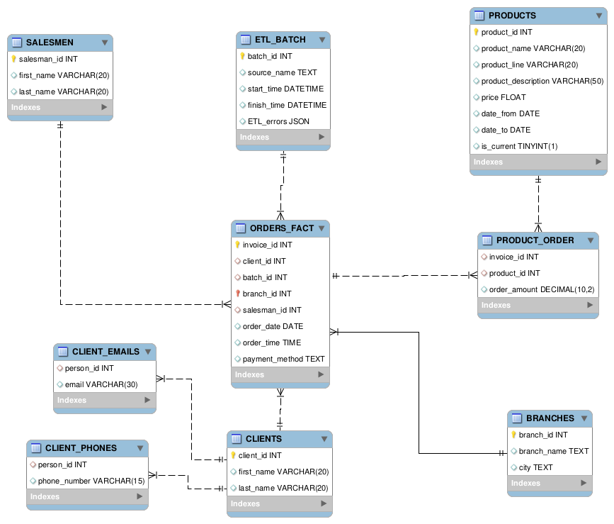

# Sales Data Pipeline

This repository implements a simple data pipeline using data warehouse concepts such as slowly changing dimensions, data cleaning, and analytical views.

> I'm currently working on error logging and creating views for this pipeline.

## Desired Outcomes

* Create synthesized datasets to test the pipeline using the Faker module.
* Build a data warehouse to store incoming CSV data.
* Apply the slowly changing dimension technique to track price changes.
* Utilize Airflow for orchestration and automate cleaning, loading, and error log reports.
* Containerizing the pipeline using docker compose.

## Goals

* Clean incoming CSV data before loading it.
* Track price changes over time.
* Create views for analytics teams to work with.
* Separate cleaned CSVs from dirty CSVs by managing directories.

## Explanation
### The Pipeline
The pipeline checks for new incoming files in the landing directory every day. If it finds any files, it retrieves their paths and passes them through XComs to cleaning tasks. These tasks then pass the cleaned data to the staging task, which stages the content to a MySQL table. Next, the data is loaded into the data warehouse and transformed as needed. Finally, the processed file is moved to the processed directory.

### The Dataware House
This Data Warehouse (DWH) schema is designed to manage and analyze sales data. It includes dimension tables for clients, salesmen, products, prices, branches, and ETL batches, which store descriptive attributes. The fact table, ORDERS_FACT, stores transactional data related to orders. Additional tables for error codes, client contact details, and product orders support data quality and relationship management.

## Areas of Improvement
* Adding more rules and conditions to price dimention.